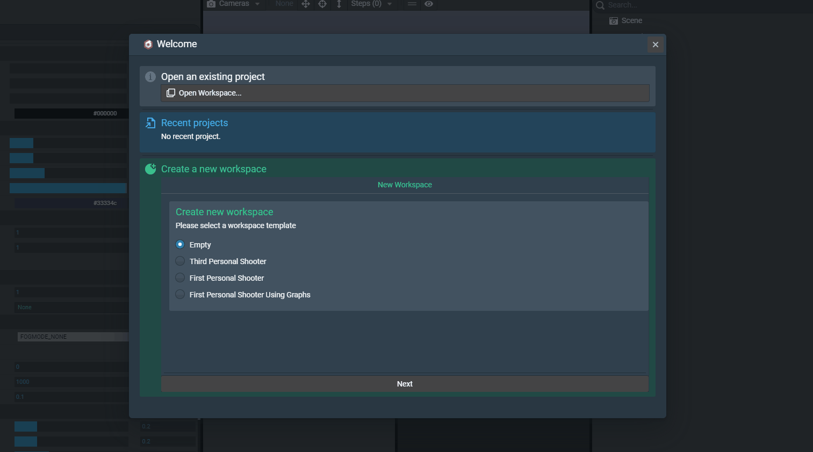

# Creating a workspace.

## Creating an empty workspace
Using the Editor, the first step consists on creating a new workspace. The workspace will allow to manage workspace-based settings and multiple projects.
It is important to understand that the Editor can't work without a workspace as it'll allow to link scene with code, export final scenes at the right place etc.

Once the Editor started, a welcome page appears and allows to:
* Open an existing workspace
* Open a recent project (contains the last 3 opened workspace)
* Create a new workspace.

Let's create a new Empty workspace. This will ask for:
* A port for local webserver. Any port can be chosen and the game will be served in `http://localhost:PORT/index.html`
* Watch project using Webpack: the projects made using the Editor use the latest ES6 modules of Babylon.JS. The workspace comes with a default configuration using Webpack to build the final dist files. This configuration can be customized. Enabling this option will make the Editor to automatically watch the project's source files for us. This is especially useful when we don't need to open any code editor or terminal and just use the Editor.

Finally, let's select and empty folder where to create the workspace and the Editor will load the newly created workspace:



## Understanding the first launch of a workspace
By default, a newly created workspace contains only basic files (assets, source files, etc.). But, to be able to build the project and compile the source files, the dependencies must be installed using npm.

At the first launch of a workspace, the editor will install the dependencies (TypeScript, WebPack, Babylon.JS, etc.) and then build the project (using WebPack). This can take a while according to the machine where the Editor is running.

## Understanding the workspace architecture


The architecture of a workspace follows basics of Web projects:
* `package.json` describes the workspace and enumerates its dependencies
* `webpack.config.js` describes the configuration of the builder (here using WebPack)
* `tsconfig.json` describes the TypeScript configurations
* `src` folder contains all TypeScript files. In other words, this folder contains all the application's sources
* `projects` folder contains the list of all available projects in the workspace
* `scenes` folder contains all the final scenes (with their files) exported by the Editor. In other words, these exported scenes will be the ones loaded when running the application/game made using the Editor.

## Understanding package.json
The `package.json` file is the main entry point of the project. It contains the list of all dependencies and a list of predefined scripts for the project.

Of course, all these dependencies and scripts can be modified/customized/removed to satisfy the project's requirement(s). For example, having a multiplayer game, the package `socket.io` (this is just an example) can be added to the dependences and the `"webserver`" script can be modified to run a custom webserver instead of using simple `http-server` command.

**Only** the `"build"` script is mandatory and must be available in the `package.json` file. Also, it must keep its job which is to build the project event if the project is fully customized.

## Understanding webpack.config.js
As well as the `pacakge.json` file, the Webpack configuration file can be customized to include whatever needed by the project. By default, it just packs the project into one single file (`"bundle.js"`) ready to be imported/called by the `index.html` file.

It is free, accoding to the user's preferences, to use Webpack plugins (including custom plugins) like the dev server (more informations here: https://webpack.js.org/configuration/dev-server/).

In fact, the `webpack.config.js` file must support both "build" and "watch" modes as the Editor allows to automatically build/watch the project instead of typing the commands by ourself. Of course, build and watch commands can be handled by ourself if needed using custom commands. For example:

```bash
npm run watch
```
Or
```bash
npm run build
```
